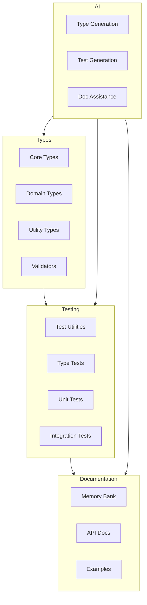
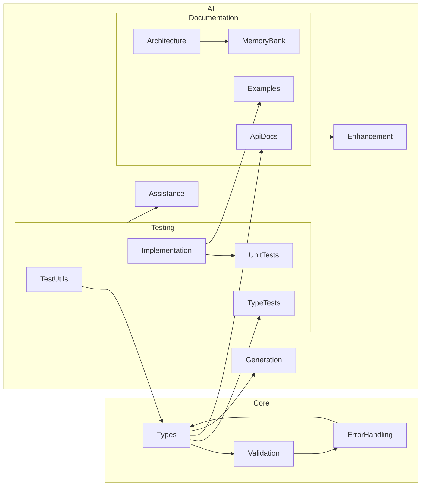

# System Patterns

## Architecture Overview

The TFTDD template follows a layered architecture that emphasizes type safety and testability:



## Key Components

1. Type System
   * Core type definitions
   * Runtime type validators
   * Type utilities
   * Error handling types

2. Testing Framework
   * Test runners
   * Custom matchers
   * Test utilities
   * Coverage tools

3. Documentation System
   * Memory Bank
   * API documentation
   * Example code
   * Development guides

4. AI Integration
   * Code generation
   * Test assistance
   * Documentation help

## Component Relationships



## Design Patterns

1. Type-First Patterns
   * Result Type Pattern

   ```typescript
   type Result<T, E = Error> = 
     | { success: true; value: T }
     | { success: false; error: E };
   ```

   * Type Validator Pattern

   ```typescript
   interface TypeValidator<T> {
     validate(input: unknown): Result<T>;
     schema: z.ZodType<T>;
   }
   ```

   * Type Guard Pattern

   ```typescript
   function isSuccess<T>(result: Result<T>): result is Success<T> {
     return result.success === true;
   }
   ```

2. Problem Management Pattern

   ```mermaid
   flowchart TD
     Start[File Modification Required] --> PreCheck[Pre-Modification Check]
     PreCheck --> Count[Document Problem Count]
     Count --> Category[Categorize Problems]
     Category --> Change[Make Changes]
     Change --> PostCheck[Post-Modification Check]
     PostCheck --> Compare{Compare Problems}
     Compare -->|New Issues| Resolve[Resolve New Issues]
     Compare -->|No New Issues| Complete[Complete Task]
     Resolve --> PostCheck
   ```

   * Pre-Modification Check

     ```typescript
     // Example problem tracking
     interface ProblemState {
       typescript: number;
       eslint: number;
       test: number;
       docs: number;
       total: number;
       details: string[];
     }
     ```

   * Problem Resolution Priority
     1. Type safety (TypeScript)
     2. Test integrity (Jest)
     3. Code style (ESLint)
     4. Documentation (Markdown)

3. Testing Patterns
   * Test-Driven Development Pattern

   ```typescript
   // 1. Write test first
   import { describe, expect, it } from '@jest/globals';
   
   describe('User', () => {
     it('should validate email format', () => {
       const result = validateEmail('test@example.com');
       expect(result.success).toBe(true);
     });
   });
   ```

   * Type Test Pattern with Strict Safety

   ```typescript
   describe('Type Tests', () => {
     it('should enforce type constraints', () => {
       type Expected = Result<string>;
       type Actual = typeof result;
       // No 'any' allowed in test files
       assertType<Expected, Actual>();
     });
   });
   ```

   * Test Factory Pattern with Type Guarantees

   ```typescript
   function createTestUser(): User {
     return {
       id: generateId(),
       name: 'Test User',
       email: 'test@example.com'
     };
   }
   ```

4. Documentation Patterns
   * Memory Bank Pattern

   ```markdown
   # Component Documentation
   ## Overview
   [Component description]
   ## Design Decisions
   [Key decisions and rationale]
   ## Usage Examples
   [Code examples]
   ```

## Data Flow

1. Type Validation Flow

   ```mermaid
   flowchart LR
     Input[Raw Input] --> Validator[Type Validator]
     Validator --> Valid{Valid?}
     Valid -->|Yes| Success[Success Result]
     Valid -->|No| Error[Error Result]
   ```

2. Test Execution Flow

   ```mermaid
   flowchart LR
     Test[Test Case] --> Setup[Test Setup]
     Setup --> Execute[Execute Test]
     Execute --> Assert[Assertions]
     Assert --> Cleanup[Test Cleanup]
   ```

3. Documentation Flow

   ```mermaid
   flowchart LR
     Code[Source Code] --> TypeDoc[TypeDoc]
     TypeDoc --> ApiDocs[API Docs]
     Code --> Memory[Memory Bank]
     Memory --> Context[Project Context]
   ```

## Key Technical Decisions

1. Type System
   * Use TypeScript strict mode
   * Implement Result type for error handling
   * Use Zod for runtime validation
   * Generate type documentation

2. Testing
   * Jest with @jest/globals for type-safe testing
   * TDD workflow with tests before implementation
   * Pre-commit test execution via Husky
   * Custom type testing utilities with strict safety
   * Test factory patterns with full type coverage
   * Automated coverage checks and isolatedModules

3. Documentation
   * Memory Bank for project context
   * TypeDoc for API documentation
   * Markdown for documentation
   * Mermaid for diagrams

4. Development Environment
   * VSCode as primary IDE
   * ESLint + Prettier for formatting
   * Automated task running
   * Debug configurations

## System Boundaries

1. Internal Systems
   * Type system
   * Test framework
   * Documentation generator
   * Development tools

2. External Systems
   * Version control
   * Package manager
   * CI/CD pipeline
   * IDE extensions

## Non-Functional Requirements

1. Performance
   * Fast type checking
   * Quick test execution
   * Efficient documentation generation

2. Maintainability
   * Clear code structure
   * Comprehensive documentation
   * Automated formatting
   * Type safety
   * Proactive problem management

3. Reliability
   * Strong type guarantees
   * Comprehensive tests
   * Error handling
   * Validation checks
   * Pre/post modification checks

4. Scalability
   * Modular architecture
   * Extensible patterns
   * Reusable components
   * Consistent problem tracking

## Technical Debt

Current technical debt items:

1. Type System
   * Additional type utilities needed
   * More type testing patterns
   * Enhanced error types

2. Testing
   * More test helpers
   * Additional matchers
   * Performance testing

3. Documentation
   * More examples needed
   * Additional diagrams
   * Usage patterns

---

This document should be updated when there are significant changes to the system architecture or design patterns.
