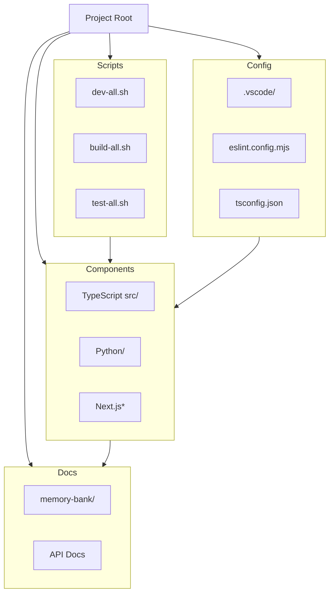
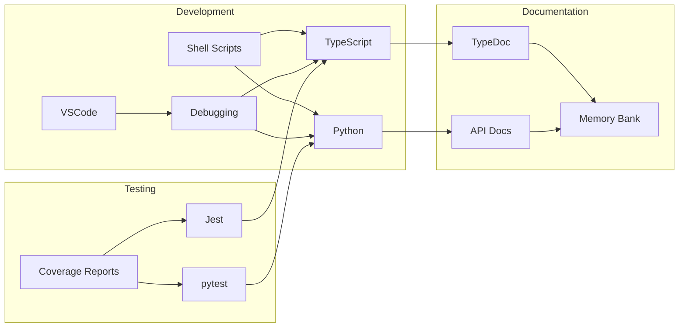

# System Patterns

## Architecture Overview

Stellar Phoenix follows a top-level modular architecture with multi-language support:



## Key Components

1. TypeScript Core

   - Business logic implementation
   - Type definitions and validation
   - Core utilities and helpers
   - Error handling patterns

2. Python Services

   - Service implementation
   - Test infrastructure (pytest)
   - Development tools (black, flake8)
   - Package management

3. Development Environment

   - VSCode workspace configuration
   - Multi-language debugging
   - Shared development scripts
   - Task automation

4. Documentation
   - Memory Bank system
   - API documentation
   - Development guides
   - Multi-language examples

## Component Integration



## Development Patterns

1. Workspace Organization

   ```
   /                  # Project root
   ├── src/           # TypeScript source
   ├── python/        # Python services
   ├── scripts/       # Shell scripts
   ├── .vscode/       # IDE configuration
   └── docs/          # Documentation
   ```

2. Script Patterns

   ```bash
   # Development script pattern
   #!/bin/bash
   set -e

   # Error handling
   handle_error() {
     echo "Error: Line $1"
     exit 1
   }
   trap 'handle_error $LINENO' ERR

   # Component execution
   start_component() {
     echo "Starting $1..."
     cd "$2"
     eval "$3"
     cd ..
   }
   ```

3. Testing Pattern

   ```typescript
   // TypeScript test pattern
   import { describe, it, expect } from '@jest/globals';

   describe('Component', () => {
     it('should behave correctly', () => {
       expect(result).toBeDefined();
     });
   });
   ```

   ```python
   # Python test pattern
   import pytest

   def test_component():
       """Test component behavior"""
       result = component.execute()
       assert result is not None
   ```

4. Problem Management Pattern

   ```mermaid
   flowchart TD
     Start[File Modification Required] --> PreCheck[Pre-Modification Check]
     PreCheck --> Count[Document Problem Count]
     Count --> Category[Categorize Problems]
     Category --> Change[Make Changes]
     Change --> PostCheck[Post-Modification Check]
     PostCheck --> Compare{Compare Problems}
     Compare -->|New Issues| Resolve[Resolve New Issues]
     Compare -->|No New Issues| Complete[Complete Task]
     Resolve --> PostCheck
   ```

   - Pre-Modification Check

     ```typescript
     // Example problem tracking
     interface ProblemState {
       typescript: number;
       eslint: number;
       test: number;
       docs: number;
       total: number;
       details: string[];
     }
     ```

   - Problem Resolution Priority
     1. Type safety (TypeScript)
     2. Test integrity (Jest)
     3. Code style (ESLint)
     4. Documentation (Markdown)

5. Testing Patterns

   - Test-Driven Development Pattern

   ```typescript
   // 1. Write test first
   import { describe, expect, it } from '@jest/globals';

   describe('User', () => {
     it('should validate email format', () => {
       const result = validateEmail('test@example.com');
       expect(result.success).toBe(true);
     });
   });
   ```

   - Type Test Pattern with Strict Safety

   ```typescript
   describe('Type Tests', () => {
     it('should enforce type constraints', () => {
       type Expected = Result<string>;
       type Actual = typeof result;
       // No 'any' allowed in test files
       assertType<Expected, Actual>();
     });
   });
   ```

   - Test Factory Pattern with Type Guarantees

   ```typescript
   function createTestUser(): User {
     return {
       id: generateId(),
       name: 'Test User',
       email: 'test@example.com',
     };
   }
   ```

6. Documentation Patterns

   - Memory Bank Pattern

   ```markdown
   # Component Documentation

   ## Overview

   [Component description]

   ## Design Decisions

   [Key decisions and rationale]

   ## Usage Examples

   [Code examples]
   ```

## Data Flow

1. Type Validation Flow

   ```mermaid
   flowchart LR
     Input[Raw Input] --> Validator[Type Validator]
     Validator --> Valid{Valid?}
     Valid -->|Yes| Success[Success Result]
     Valid -->|No| Error[Error Result]
   ```

2. Test Execution Flow

   ```mermaid
   flowchart LR
     Test[Test Case] --> Setup[Test Setup]
     Setup --> Execute[Execute Test]
     Execute --> Assert[Assertions]
     Assert --> Cleanup[Test Cleanup]
   ```

3. Documentation Flow

   ```mermaid
   flowchart LR
     Code[Source Code] --> TypeDoc[TypeDoc]
     TypeDoc --> ApiDocs[API Docs]
     Code --> Memory[Memory Bank]
     Memory --> Context[Project Context]
   ```

## Key Technical Decisions

1. Project Structure

   - Top-level component organization
   - Language-specific tooling
   - Shared development scripts
   - Unified debugging experience

2. Development Environment

   - VSCode as primary IDE
   - Multi-language support
   - Integrated debugging
   - Automated workflows

3. Testing Strategy

   - Language-specific test runners
   - Unified coverage reporting
   - Automated test execution
   - Cross-language integration tests

4. Documentation
   - Memory Bank as source of truth
   - API documentation per language
   - Shared development guides
   - Unified workspace docs

## System Boundaries

1. Internal Systems

   - Type system
   - Test framework
   - Documentation generator
   - Development tools

2. External Systems
   - Version control
   - Package manager
   - CI/CD pipeline
   - IDE extensions

## Non-Functional Requirements

1. Development Experience

   - Quick setup process
   - Unified debugging experience
   - Consistent code style
   - Automated workflows

2. Maintainability

   - Clear component boundaries
   - Comprehensive documentation
   - Automated formatting
   - Language-specific best practices

3. Reliability

   - Strong testing coverage
   - Comprehensive error handling
   - Validated deployment process
   - Regular dependency updates

4. Scalability
   - Modular architecture
   - Language-agnostic interfaces
   - Clear integration points
   - Future remote capabilities

## Technical Debt Items

1. Development Environment

   - Container configurations needed
   - Additional development scripts
   - Enhanced debugging configs
   - IDE extensions setup

2. Testing Infrastructure

   - Cross-language testing tools
   - Integration test framework
   - Performance benchmarks
   - Coverage thresholds

3. Documentation
   - Service API documentation
   - Integration guides
   - Deployment procedures
   - Monitoring setup

---

This document should be updated when there are significant changes to the system architecture or design patterns.
