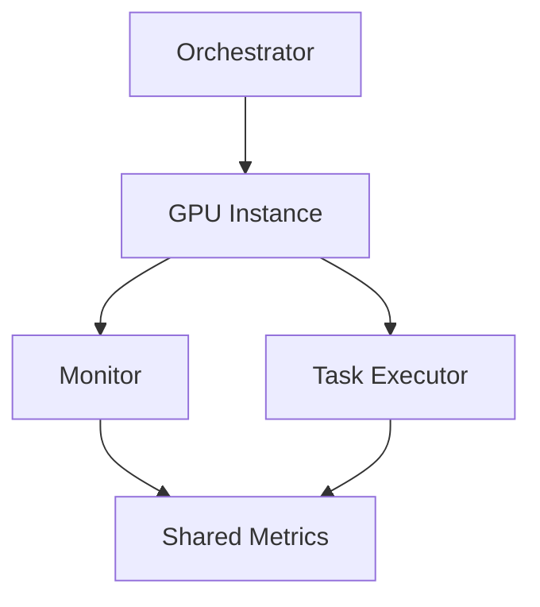

# Architecture Overview

## System Components

1. **Orchestration Layer**
   - Instance provisioning
   - Environment setup
   - Resource management

2. **Execution Layer**
   - GPU task execution with configurable workloads
   - Error handling and self-validation
   - Metrics export (JSON and Prometheus formats)

3. **Monitoring Layer**
   - Resource utilization tracking
   - Performance metrics collection
   - Log aggregation and standardized interoperability

## Component Interaction

## Security Considerations

1. **Access Control**
   - IAM roles and policies
   - Security groups and SSH key management

2. **Data Security**
   - Encryption at rest and in transit
   - Access logging

## Scaling Strategy

1. **Horizontal Scaling**
   - Multi-instance support
   - Load balancing and instance pooling

2. **Resource Optimization**
   - GPU utilization monitoring
   - Auto-scaling rules and cost optimization
