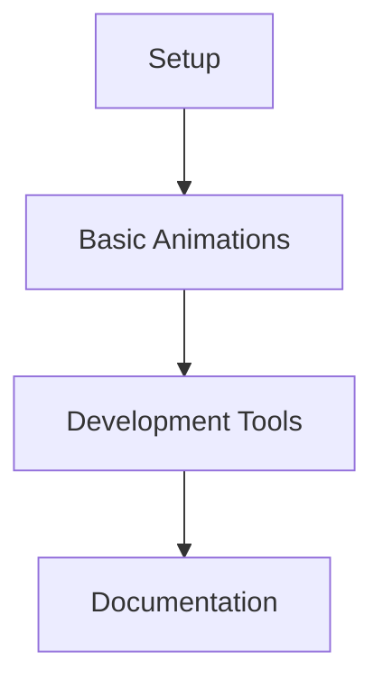
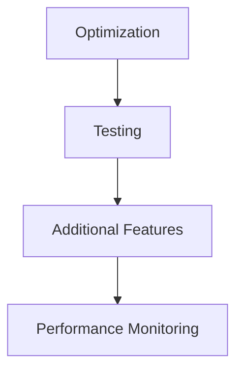
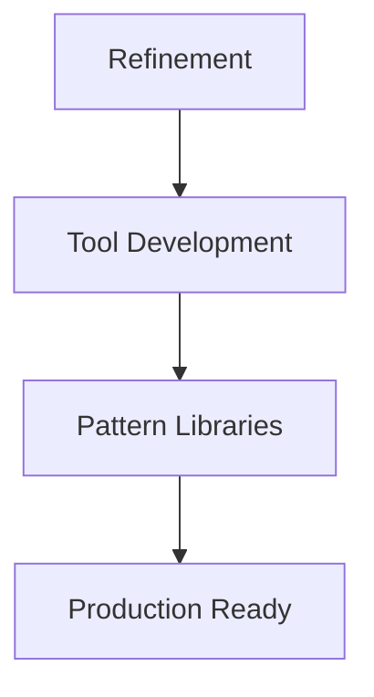

# Product Context

## Purpose

This project demonstrates a modern real-time development workflow for Next.js applications, focusing on interactive animations and immediate feedback loops. It serves as both a learning tool and a reference implementation for efficient frontend development practices.

## Core Problems Solved

1. Development Feedback
   - Instant preview of code changes
   - Real-time error detection
   - Type safety validation
   - Style updates visualization

2. Animation Implementation
   - Consistent animation patterns
   - State-based transitions
   - Loading state management
   - Interactive feedback

3. Development Efficiency
   - Reduced iteration time
   - Immediate error catching
   - Visual feedback loops
   - Type-safe development

## User Experience Goals

### For Developers

1. Development Flow

   ```mermaid
   flowchart LR
       A[Code Change] --> B[Instant Preview]
       B --> C[Error Feedback]
       C --> D[Refinement]
       D --> A
   ```

2. Key Benefits
   - Immediate visual feedback
   - Type safety guarantees
   - Animation consistency
   - Development efficiency

3. Pain Points Addressed
   - Slow feedback cycles
   - Animation inconsistencies
   - Type errors in production
   - Style synchronization

### For End Users

1. Experience Quality
   - Smooth animations
   - Consistent interactions
   - Responsive feedback
   - Polished interfaces

2. Performance
   - Optimized animations
   - Efficient updates
   - Reduced jank
   - Better accessibility

## Implementation Goals

### Real-time Development

1. Code Changes
   - Hot Module Replacement
   - Instant preview updates
   - Error boundary catching
   - Style hot reloading

2. Type Safety
   - Real-time type checking
   - Auto-completion
   - Error prevention
   - Code intelligence

### Animation System

1. Core Features
   - State-based animations
   - Loading indicators
   - Interactive feedback
   - Transition effects

2. Requirements
   - Performance optimization
   - Accessibility support
   - Cross-browser compatibility
   - Reduced motion support

## Success Criteria

### Development Experience

1. Speed
   - Sub-second preview updates
   - Immediate error feedback
   - Quick iteration cycles
   - Fast builds

2. Quality
   - Zero type errors
   - Consistent animations
   - Reliable hot reloading
   - Clear error messages

### User Experience

1. Performance
   - 60fps animations
   - Smooth transitions
   - Responsive interactions
   - No visual glitches

2. Accessibility
   - Motion reduction support
   - Clear visual feedback
   - Keyboard navigation
   - Screen reader compatibility

## Roadmap

### Phase 1: Foundation ✓



### Phase 2: Enhancement 🚧



### Phase 3: Polish 📋



## Feature Requirements

### Development Tools

1. Editor Integration
   - VSCode settings
   - Extension support
   - Code formatting
   - Linting rules

2. Preview System
   - Hot reloading
   - Error overlay
   - Style updates
   - State preservation

### Animation System

1. Core Animations
   - Transitions
   - Loading states
   - Hover effects
   - Focus states

2. Performance
   - Optimized rendering
   - Efficient updates
   - Memory management
   - Bundle optimization

## Project Scope

### Included

1. Development Features
   - Real-time preview
   - Type checking
   - Error handling
   - Hot reloading

2. Animation Features
   - State transitions
   - Loading indicators
   - Interactive feedback
   - Accessibility support

### Future Considerations

1. Enhanced Features
   - Complex animations
   - Gesture support
   - 3D transforms
   - Advanced transitions

2. Development Tools
   - Animation debugger
   - Performance monitor
   - State inspector
   - Pattern library

## Success Metrics

### Development Efficiency

1. Quantitative
   - Build time < 2s
   - Preview update < 100ms
   - Zero type errors
   - 100% test coverage

2. Qualitative
   - Developer satisfaction
   - Code maintainability
   - Documentation clarity
   - Tool usability

### User Experience

1. Performance
   - Animation FPS > 60
   - Time to interactive < 100ms
   - Memory usage stable
   - Network efficient

2. Quality
   - Visual consistency
   - Interaction reliability
   - Cross-browser support
   - Accessibility compliance
