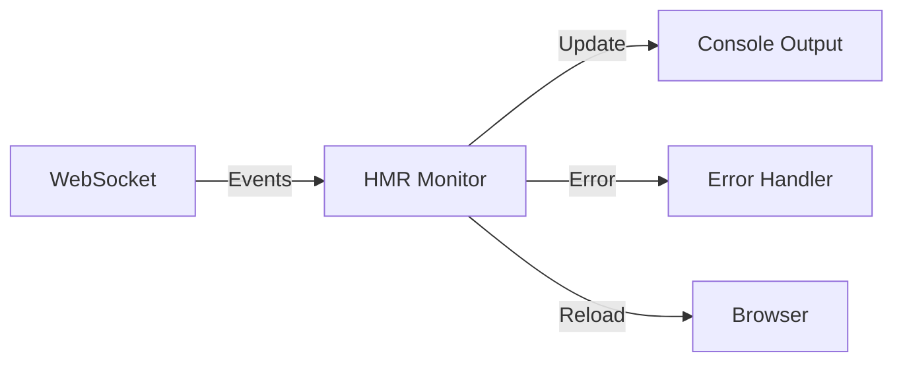
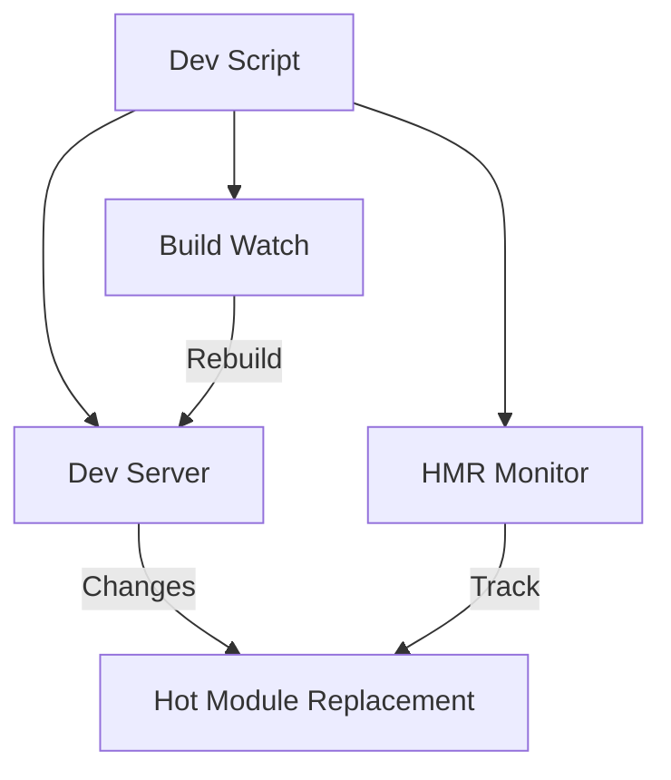
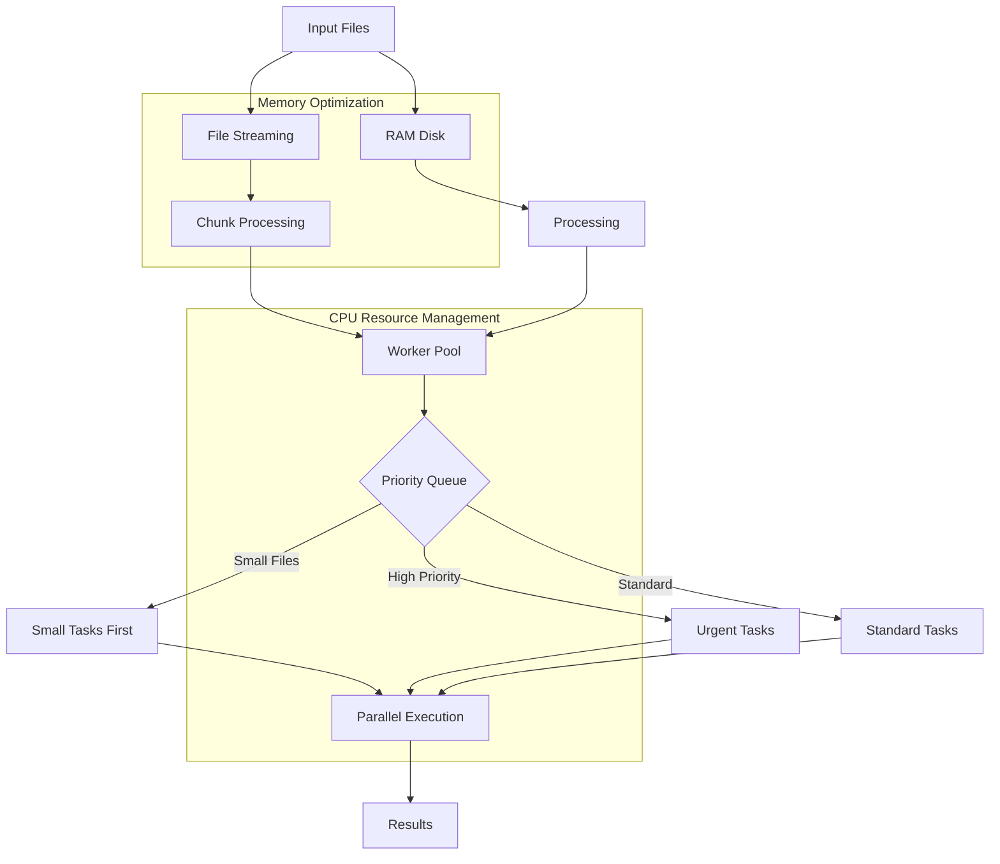

# System Patterns

- Project structure:
  - memory-bank/: Contains all project documentation.
  - src/: Contains source code.
  - tests/: Contains test files.

## Development Architecture

### Incremental Development Workflow

The project implements a comprehensive incremental development workflow that ensures developers can quickly get to a stable state and maintain awareness of the project context while making changes.

#### Development Scripts

- `setup.sh` - Interactive setup script that provides multiple development mode options
- `dev-watch.sh` - Enhanced development script with Memory Bank monitoring and multiple watch options

#### NPM Scripts

- `npm run dev` - Standard Next.js development server
- `npm run dev:watch` - Next.js development with watch mode
- `npm run build` - Production build
- `npm run build:watch` - Watch mode for TypeScript compilation
- `npm run start` - Compile TypeScript and start the application
- `npm run start:watch` - Start with automatic restart on changes
- `npm run watch` - Run TypeScript compilation and node server with live reload
- `npm run dev-watch` - Interactive development with Memory Bank monitoring

#### Development Workflow Stages

1. Initialize with `./setup.sh` or `npm run setup`
2. Choose development mode based on task requirements
3. Make incremental changes with continuous feedback
4. Monitor Memory Bank context to maintain awareness
5. Validate changes automatically through watch mode

### Error Handling System

```mermaid
flowchart TD
    Error[Error Occurs] --> Handler[Error Handler]
    Handler --> Classify{Classify Error}
    Classify -->|Build| BuildError[Build Error Handler]
    Classify -->|HMR| HMRError[HMR Error Handler]
    Classify -->|Runtime| Runtime Error Handler]
    Classify -->|Network| NetworkError[Network Error Handler]
    
    BuildError --> ShowOverlay[Show Error Overlay]
    HMRError --> Retry[Retry Connection]
    RuntimeError --> Reload[Page Reload]
    NetworkError --> Reconnect[Reconnect]

    ShowOverlay --> Log[Log Error]
    Retry --> Log
    Reload --> Log
    Reconnect --> Log
```

### HMR Monitoring



### Development Workflow



## Core Components

### Error Handler

- Singleton pattern implementation
- Error classification system
- Recovery strategies
- Retry mechanisms
- Developer notifications

### Error Overlay

- React-based error display
- Severity-based styling
- Stack trace support
- Dismissible interface
- Configurable timeout

### HMR Monitor

- WebSocket connection management
- Event tracking
- Colored console output
- Automatic reconnection
- Process cleanup

### Development Script

- Process management
- Parallel execution
- Color-coded output
- Graceful shutdown

## Technical Implementation

### Scripts Organization

```
scripts/
├── error-handler.ts    # Error handling system
├── error-overlay.tsx   # Error UI component
├── hmr-monitor.ts     # HMR monitoring system
├── dev.ts             # Development orchestration
├── extract_with_libarchive.py  # Extraction optimisée avec libarchive
├── file-streamer.js    # Streaming de fichiers par chunks
├── optimized-pipeline.js # Pipeline optimisé démonstration
├── setup_ramdisk.sh    # Configuration d'un RAM Disk pour I/O
└── worker-pool.ts      # Gestion optimisée des tâches concurrentes
```

### Optimized Pipeline Architecture



### Composants d'Optimisation

#### RAM Disk (tmpfs)

- Montage d'un système de fichiers en mémoire
- Réduction drastique des latences d'accès disque
- Configuration via `setup_ramdisk.sh`
- Taille configurable selon les besoins
- Intégré automatiquement dans le pipeline de traitement

#### File Streaming

- Lecture et écriture des fichiers par chunks
- Empreinte mémoire réduite pour les gros fichiers
- Pipeline de transformation configurable
- Capable de traiter des fichiers de taille arbitraire
- Implémenté dans `file-streamer.js`

#### Worker Pool

- Limitation dynamique du nombre de workers selon les CPU disponibles
- File d'attente avec priorité et optimisation de l'ordre d'exécution
- Métriques de performance et monitoring
- Priorisation des petites tâches pour libérer rapidement les ressources
- Implémenté dans `worker-pool.ts`

#### Extraction Optimisée

- Utilisation de libarchive pour des performances d'extraction supérieures
- Support de multiples formats d'archives
- Intégration avec le reste du pipeline optimisé
- Implémenté dans `extract_with_libarchive.py`

### System Patterns

- **extract_with_libarchive.py**: Script Python utilisant `libarchive` pour extraire efficacement des archives.
- **setup_ramdisk.sh**: Script POSIX pour configurer un RAM Disk (tmpfs) et réduire les latences d'accès disque.
- **file-streamer.js**: Module permettant le traitement de fichiers en streaming par chunks sans charger l'intégralité en mémoire.
- **worker-pool.ts**: Implémentation TypeScript d'un pool de workers avec gestion intelligente des ressources CPU.
- **optimized-pipeline.js**: Script de démonstration qui combine toutes les optimisations en un pipeline complet.
- **ESLint Configuration**: Disabled the `@typescript-eslint/no-explicit-any` rule to allow the use of `any` type in TypeScript.
- **Import Statements**: Updated import statements in `file-streamer.js`, `optimized-pipeline.js`, and `worker-pool.ts` to use ES6 modules instead of `require()`.

### NPM Scripts

- `dev` - Standard development server
- `dev:watch` - Enhanced development with monitoring
- `dev:monitor` - Standalone HMR monitoring
- `build` - Production build
- `build:watch` - Watch mode build

## Best Practices

### Error Recovery

1. Attempt automatic recovery when possible
2. Provide clear error messages
3. Show stack traces in development
4. Log all errors for debugging

### Development Experience

1. Real-time feedback
2. Clear error visualization
3. Automatic reconnection
4. Process management
5. Colored terminal output

### Performance Optimization

1. Utiliser un RAM Disk pour les opérations temporaires fréquentes
2. Traiter les fichiers par chunks pour minimiser l'empreinte mémoire
3. Limiter le nombre de workers à (CPU - 1) pour éviter la surcharge
4. Prioriser les petites tâches pour libérer rapidement les ressources
5. Utiliser des bibliothèques optimisées comme libarchive
6. Implémenter la compression/décompression parallèle quand possible

### State Management

1. Preserve form inputs during HMR
2. Maintain navigation state
3. Keep WebSocket connections
4. Track retry attempts

## Future Considerations

1. Error aggregation and reporting
2. Performance monitoring
3. Extended debugging tools
4. Custom error recovery strategies
5. Intégration d'une file d'attente distribuée (Redis/Kafka/RabbitMQ)
6. Configuration d'une infrastructure scalable multi-machines
7. Implémentation de mécanismes de reprise sur échec
